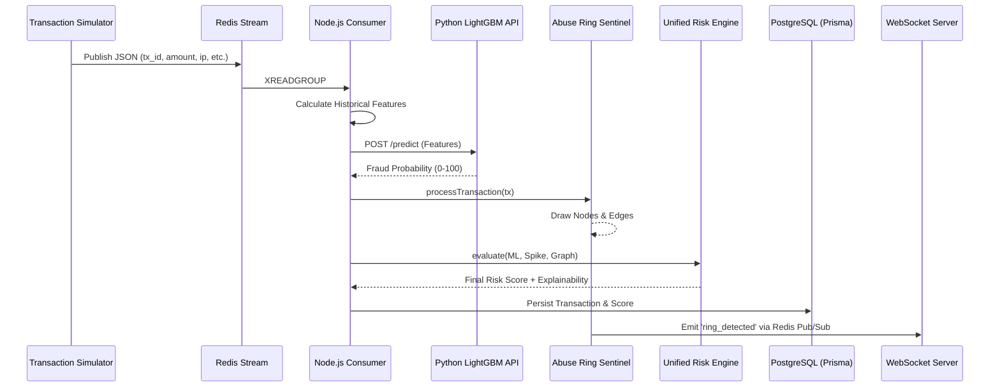
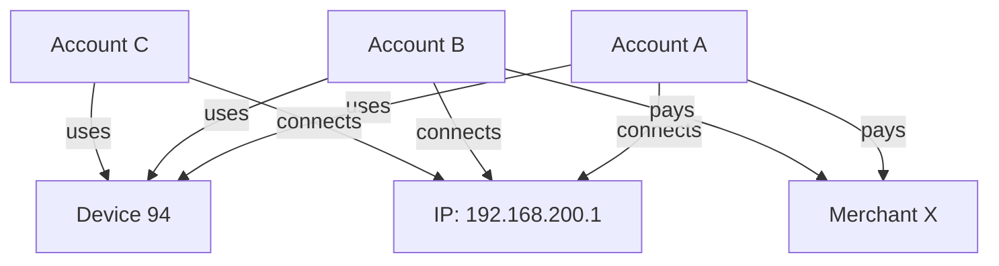

# Argus — Backend Architecture

This document provides an in-depth, technical explanation of the backend data flow, real-time analytics engines, machine learning integration, and the specific algorithmic rules governing the system.

---

## 1. High-Level Data Flow

The backend is built around a **real-time, event-driven streaming architecture** designed for high throughput.



---

## 2. The Analytics Engines

The Node.js Consumer pipeline routes every transaction through **four specialized engines** before persisting it to the database.

### A. The Real-Time Feature Engine (`consumer.ts`)
Before a transaction can be scored by the ML model, it must be contextualized. The feature engine maintains a **sliding historical window** of transactions per account in-memory.

**Rules Calculated:**
*   `event_count`: Number of transactions in the recent window.
*   `amount_mean` / `amount_std`: Statistical variance of transaction amounts for the entity.
*   `unique_destinations`: Entropy of distinct merchants targeted.
*   `max_entity_relative_velocity`: Comparison of current velocity to historical lags.

---

### B. Machine Learning Service (`app/api.py`)
The calculated features are sent over HTTP to the Python FastAPI microservice.

**How it works:**
*   Powered by **LightGBM (Gradient Boosted Decision Trees)**.
*   It operates strictly on *backward-looking historical features* to ensure Zero Data Leakage.
*   It outputs a `fraud_probability` (0.0 to 1.0), indicating the statistical likelihood of fraud based on training distributions.

---

### C. Spike Detection Engine (`spike_engine.ts`)
Identifies sudden velocity and volume anomalies. 

**Rules:**
1.  Monitors the Transactions Per Second (TPS) of individual accounts/merchants against a known `BASELINE_TPS`.
2.  If the ML score triggers an alert (>50), it opens an **Active Spike** state.
3.  Tracks the `peakTps` and aggregates the total `transactionCount` and `$amount`.
4.  Once traffic falls below the baseline and the threshold expires, the spike is transitioned to a **Historical Spike** and archived.

---

### D. Abuse Ring Sentinel (`graph_engine.ts`)
The most complex engine in the system. It builds an in-memory graph by mapping incoming transactions to entities.



**Ring Detection Logic (Runs every 15s over a rolling 60s window):**
1.  **Candidate Selection**: Identifies any Device or IP shared by **≥ 3 distinct accounts** with **≥ 5 transactions** in the last 60 seconds.
2.  **Deduplication**: Generates a deterministic hash (Fingerprint) of the sorted accounts and infrastructure to prevent duplicating the same ring.
3.  **Multi-Signal Scoring (0-100)**:
    *   **Shared Device (25 pts)**: Scales up if 5+ or 8+ accounts share the same physical device ID.
    *   **Shared IP (20 pts)**: Scales up if 10+ or 20+ accounts share the same IP.
    *   **Temporal Coordination (20 pts)**: Scans for tight clusters. If >80% of transactions happen within a 10-second window, it's highly synchronized.
    *   **Velocity Multiplier (15 pts)**: Compares transaction burst against expected baseline.
    *   **Amount Similarity (10 pts)**: Uses Coefficient of Variation (StdDev / Mean). If amounts are nearly identical, the score increases.
4.  **Strong Confirmation Rule**: A cluster requires at least *two independent strong signals* (e.g., Shared Device + Extreme Synchronization) to be upgraded from `SUSPICIOUS_CLUSTER` to `CRITICAL_RING`.
5.  **Alerting**: Publishes the detected ring to the Redis `ring_alerts` channel.

---

### E. Unified Risk Engine (`risk_engine.ts`)
No single engine dictates the final outcome. The Unified Risk Engine acts as the final judge for every transaction.

**Algorithm:**
```text
Final Risk Score = 
  (ML Score * 0.4) 
+ (Spike Score * 0.3) 
+ (Graph/Ring Score * 0.3) 
+ (Temporal Bonus * 0.1)
```

**Explainability (Phase 9):**
Instead of outputting a black-box number, the engine stores exactly how many points were contributed by each sub-engine. It translates these weights into an array of `WHY FLAGGED?` reasons:
*   *"+40 High LightGBM fraud probability"*
*   *"+30 Suspicious shared infrastructure (Abuse Ring)"*
*   *"+15 Extreme transaction velocity"*

---

## 3. Database Persistence (Prisma)

The backend uses **Prisma ORM** to save persistent state to PostgreSQL. Because real-time streaming is too fast for individual blocking DB writes, the persistence strategy is split:

*   **Transactions (`model Transaction`)**: Written to the DB continuously alongside their detailed `RiskScore` relations.
*   **Abuse Rings (`model AbuseRing`)**: Periodically upserted every 15 seconds by the Graph Engine. Inserts/Updates the parent ring and the individual `RingMembers`.
*   **Spikes (`model Spike`)**: Upserted actively when detected, and updated with an `endTime` when the burst concludes.

---

## 4. Node.js WebSocket API (`server.ts`)

The backend serves the Next.js frontend using:
1.  **Express REST APIs**: Exposes endpoints to fetch historical rings, spikes, and investigation data from Prisma.
2.  **Socket.IO**: Maintains persistent connections with the frontend dashboard.
3.  **Redis Pub/Sub**: Listens to the `ring_alerts` and `spike_alerts` channels, allowing the Node.js backend to instantly broadcast new critical detections to all connected clients simultaneously with sub-second latency.

### 1. Prisma Schema (Exact Field Names)

  The frontend MUST map directly to these exact camelCase field names generated by Prisma:

  • Transaction: id, accountId, deviceId, ipAddress, merchantId, amount, timestamp (DateTime), type, riskScore (relation)
  • RiskScore: id, transactionId, finalScore (Float), severity (String), signalsJson (Stringified JSON array of { reason,
  contribution })
  • Spike: id, startTime (DateTime), endTime (DateTime?), peakTps (Float), baselineTps (Float), transactionCount (Int), amount
  (Float), severity (String)
  • AbuseRing: id, status (String), riskScore (Float), severity (String), transactionCount (Int), totalAmount (Float),
  velocityMultiplier (Float), temporalCoordination (Float), createdAt (DateTime)
  • RingMember: id, ringId, accountId
  ──────
  ### 2. Exact API Contract (REST Endpoints)

  GET /api/dashboard/metrics

    {
      "live_tps": 42.5,
      "active_spikes": 2,
      "active_rings": 1,
      "money_at_risk": 28400.50,
      "detection_latency_ms": 45
    }

  GET /api/rings

    {
      "status": "success",
      "data": [
        {
          "id": "RING-E8FA132C",
          "severity": "CRITICAL_RING",
          "riskScore": 95,
          "transactionCount": 15,
          "totalAmount": 3902.14,
          "members": [{"accountId": "acc_119"}, {"accountId": "acc_587"}]
        }
      ]
    }

  GET /api/transactions/:id

    {
      "status": "success",
      "data": {
        "id": "tx_atk_1788454225873_19",
        "accountId": "acc_attacker_1",
        "amount": 4500.00,
        "riskScore": {
          "finalScore": 95,
          "severity": "CRITICAL",
          "signalsJson": "[{\"reason\":\"High LightGBM fraud probability\",\"contribution\":40}, {\"reason\":\"Extreme
  transaction velocity (Spike)\",\"contribution\":30}]"
        }
      }
    }
  ──────
  ### 3. WebSocket Event Payloads (Socket.IO)

  Connected to http://localhost:4000, listening to these events:

  Event: ring_detected

    {
      "event_type": "CRITICAL_RING_DETECTED",
      "ring_id": "RING-E8FA132C",
      "risk_score": 95,
      "severity": "CRITICAL_RING",
      "graphData": {
        "nodes": [{"id": "acc_119", "type": "Account"}, {"id": "dev_24", "type": "Device"}],
        "edges": [{"source": "acc_119", "target": "dev_24", "relation": "uses", "weight": 5}]
      }
    }

  Event: new_transaction

    {
      "transaction_id": "tx_123",
      "amount": 150.00,
      "finalScore": 70,
      "severity": "HIGH"
    }
  ──────
  ### 4. Pages & Views Required

  You should request these 4 distinct views:

  1. Command Center (Overview): High-level KPI widgets (Live TPS, Money at Risk), a live scrolling transaction feed on the
  right, and two small active alert panels (Active Rings, Active Spikes).
  2. Ring Explorer (/rings): A list of active/historical rings on the left. Clicking one opens a deep-dive view on the right
  showing the Node-Link Graph, member list, and scoring breakdown.
  3. Spike Timeline (/spikes): A time-series chart (e.g., using Recharts) showing the baseline TPS line vs actual TPS,
  highlighting the anomalous bursts in red.
  4. Transaction Investigation Modal: Clicking any transaction in the live feed opens a modal showing the "Unified Risk Score"
  dial (0-100) and the "WHY FLAGGED?" explainability breakdown.

  Auth: Skip a real auth backend to save time. Just implement a hardcoded aesthetic "SOC Login Screen" that accepts any
  password to enter. It adds to the demo polish.
  ──────
  ### 5. Design Direction (Aesthetic & Color Coding)

  For a Buildathon/Hackathon, visual identity is 50% of the scoring. You need a "Cybersecurity Operations Center (SOC) /
  FinTech Anti-Fraud" aesthetic.

  • Theme: Dark mode (deep navy/black backgrounds #0F172A or #000000).
  • Typography: Monospace fonts (like JetBrains Mono or Fira Code) for IDs, scores, and logs to make it look highly technical.
  Inter/Roboto for standard text.
  • Strict Color Coding:
      • CRITICAL (80-100): Neon Red/Crimson (#EF4444)
      • HIGH (60-79): Neon Orange (#F97316)
      • ELEVATED/SUSPICIOUS (40-59): Yellow (#FACC15)
      • NORMAL (0-39): Muted Green or Blue (#10B981 or #3B82F6)

  ──────
  ### 6. Graph Visualization Expectation

  DO NOT use tabular ring info. It is boring and will not impress judges.
  You absolutely MUST request an interactive node-link graph for the Abuse Ring Sentinel.

  • Tell the frontend generator to use a library like react-force-graph-2d or recharts / vis-network.
  • Nodes should be styled by type (e.g., Accounts = Blue Circles, Devices = Orange Triangles, IPs = Purple Squares).
  • The backend explicitly passes graphData: { nodes, edges } directly for this exact purpose!
  ──────
  ### 7. Deployment Context

  For the hackathon demo, write the prompt assuming Localhost Setup:

  • The Next.js app runs on http://localhost:3000.
  • All REST API calls and WebSocket connections must point to http://localhost:4000.
  • Tell the generator to put NEXT_PUBLIC_API_URL=http://localhost:4000 in a .env.local file and use it for all axios and
  socket.io-client instantiations.