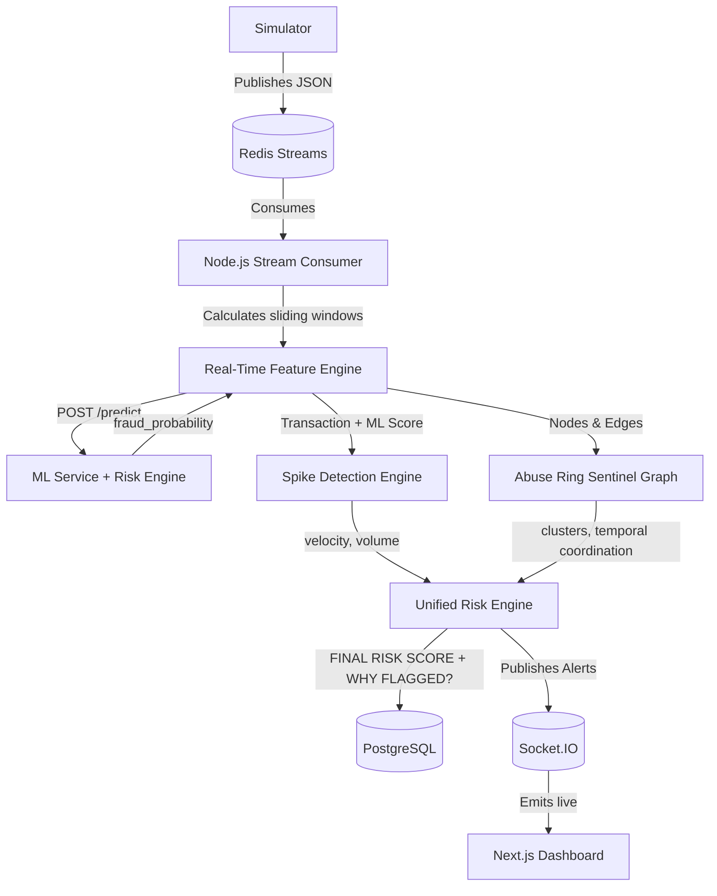

# Fraud Spike Detector & Abuse Ring Sentinel

## 1. Overview

This project is a real-time financial fraud detection and abuse-ring investigation system designed to protect transaction streams. The system ingests high-throughput data to instantly detect:

*   **Transaction-level fraud:** Identifying suspicious individual transactions using offline-trained Machine Learning (LightGBM).
*   **Velocity spikes:** Recognizing sudden, coordinated bursts in transaction volume or cumulative amounts.
*   **Abuse rings:** Uncovering coordinated networks of accounts, devices, and IP addresses exhibiting synchronized behavior.

*Note: This repository represents a technical/demo implementation running on synthetic transaction traffic and is not currently integrated with a live payment gateway.*

## 2. Key Features

*   **Real-time transaction streaming:** Ingestion and processing of high-velocity synthetic traffic.
*   **ML fraud scoring:** Feature extraction and inference using a pre-trained LightGBM model.
*   **Rule-based risk signals:** Evaluates device/IP sharing, amount similarities, and coordination.
*   **Velocity/spike detection:** Sliding window mechanics to detect volume and velocity anomalies.
*   **Abuse-ring detection:** Memory-based graph engine to surface coordinated multi-actor attacks.
*   **Graph-based investigation:** Visual relationship mapping of entities (Account, Device, IP, Merchant).
*   **Redis Streams:** High-throughput asynchronous message broker for decoupling the simulator and consumer.
*   **PostgreSQL persistence:** Durable storage for transactions, alerts, and ring states via Prisma ORM.
*   **Socket.IO live updates:** Low-latency WebSocket connections piping telemetry to the frontend.
*   **Analyst dashboard:** A Next.js command center for monitoring threats and system health.
*   **Transaction investigation:** Deep-dive modal into individual flagged transactions and ML features.
*   **Ring exploration:** Dedicated workspace for traversing extracted abuse rings.
*   **Spike timeline:** Visual representation of volumetric attacks over time.

## 3. Architecture

The system utilizes an event-driven streaming architecture bridging a high-throughput Node.js layer with a Python machine learning service.



*The ML service (FastAPI) is strictly decoupled from the Node backend, exposing a unified prediction endpoint over HTTP.*

## 4. Tech Stack

| Component | Technology |
| :--- | :--- |
| **Frontend** | Next.js 14, React, Tailwind CSS, Recharts |
| **Backend** | Node.js, Express, TypeScript |
| **Streaming** | Redis Streams (via `ioredis`) |
| **Database** | PostgreSQL, Prisma ORM |
| **Cache/Queue** | Redis Pub/Sub |
| **ML** | Python, FastAPI, LightGBM, Scikit-Learn, Pandas |
| **Visualization** | Custom Graph Visualizer, D3/Recharts concepts |
| **Real-time communication** | Socket.IO |
| **Deployment** | Docker (ML), Node Runtime, Static/Vercel (Frontend) |

## 5. Project Structure

```
fraud-spike-detector/
├── web/                   # Next.js Command Center (Frontend)
├── streaming/             # Node.js Event Consumer & API Backend
├── ML/                    # Python FastAPI Service & Model Training Pipelines
├── README.MD              # Project Documentation
├── BACKEND.MD             # Detailed backend architecture notes
├── PLAN.MD                # Execution roadmap
├── .gitignore             # Global git ignores
└── docs/assets/architecture.png  # UI Screenshot
```

## 6. Detection Pipeline

1.  **Transaction generation:** The `simulator.ts` module generates a mix of synthetic baseline traffic and targeted attacks.
2.  **Redis stream:** Transactions are pushed to a Redis Stream (`transactions:stream`).
3.  **Consumer:** The Node.js event loop pulls messages sequentially.
4.  **ML prediction:** Historical features are bundled and sent to the FastAPI service to retrieve a base fraud probability.
5.  **Risk scoring:** The stream passes through the Spike and Graph engines to accumulate rule-based penalties.
6.  **Spike detection:** Calculates rolling baselines to detect volumetric attacks.
7.  **Ring detection:** Updates an in-memory graph connecting entities to detect shared infrastructure and synchronized timing.
8.  **PostgreSQL:** The final normalized transaction, features, and relationship edges are stored durably.
9.  **Socket.IO:** A Redis subscriber listens for alerts and broadcasts them over WebSockets.
10. **Analyst dashboard:** The Next.js frontend updates visually in real time.

## 7. Fraud Risk Scoring

Transactions are assigned a final risk score (`0-100`) based on an aggregation of multiple signals:

*   **ML probability:** The raw prediction score returned by the LightGBM model.
*   **Velocity:** Exponential penalties for rapid succession transactions.
*   **Amount anomaly:** Flags for suspiciously repetitive transaction values.
*   **Temporal coordination:** High synchronization between independent accounts.
*   **Shared device/IP:** Connections to known high-risk hardware or network identifiers.

The final score is classified by severity: `LOW`, `MEDIUM`, `HIGH`, `CRITICAL`.

## 8. Abuse Ring Detection

The Graph Engine dynamically maps relationships within a sliding time window:
*   `Account → uses → Device`
*   `Account → connects → IP`

When multiple supposedly distinct accounts share the same hardware or network parameters within a tight temporal window, the engine extracts a sub-graph cluster, scores the severity of the overlap, and emits an Abuse Ring alert.

## 9. Real-Time Dashboard

The Next.js frontend is divided into three primary investigative views:

1.  **Command Center:** The primary hub. Displays live system metrics, a real-time transaction stream, the velocity chart, and global alerts.
2.  **Ring Explorer:** Dedicated workspace for visualizing extracted abuse rings, including the network graph and scoring signals.
3.  **Spike Timeline:** Historical and active visualization of volumetric anomalies and velocity thresholds.

## 10. Local Development

### Requirements

*   Node.js (v18+)
*   Python (3.11+)
*   `uv` (Fast Python package installer)
*   PostgreSQL
*   Redis

### Startup Sequence

1. **Start infrastructure** (Redis and PostgreSQL).
2. **Setup Databases**:
   ```bash
   cd streaming
   npx prisma db push
   npx prisma generate
   ```
3. **Boot ML Service**:
   ```bash
   cd ML
   uv sync
   uv run uvicorn app.api:app --host 127.0.0.1 --port 8000
   ```
4. **Boot Streaming Backend & Consumer**:
   ```bash
   cd streaming
   npm install
   npm run dev      # Starts the REST/WebSocket API
   # In a new terminal:
   npx ts-node src/consumer.ts
   # In a new terminal:
   npx ts-node src/simulator.ts
   ```
5. **Boot Frontend**:
   ```bash
   cd web
   npm install
   npm run dev
   ```

## 11. Environment Variables

Copy the provided `.env.example` files to `.env` or `.env.local` in their respective directories.

**Frontend (`web/.env.local`)**:
*   `NEXT_PUBLIC_API_URL`: Points to the Node.js backend (e.g., `http://localhost:4000`).

**Backend (`streaming/.env`)**:
*   `DATABASE_URL`: PostgreSQL connection string.
*   `REDIS_URL`: Redis connection string.
*   `ML_API_URL`: Points to the FastAPI ML service (e.g., `http://127.0.0.1:8000`).
*   `FRONTEND_URL`: Used for strict CORS enforcement in production.
*   `NODE_ENV`: Set to `production` to enforce environment variable validation.

**ML Service (`ML/.env`)**:
*   `PORT`: Dynamic port binding (defaults to `8000`).

*Note: The `.env.example` templates contain safe, fake data. Never commit real credentials.*

## 12. ML Service

The ML service is an isolated Python microservice built with FastAPI. It loads a pre-trained LightGBM model and exposes a low-latency `/predict` endpoint.

**Run Locally:**
```bash
cd ML
uv sync
uv run uvicorn app.api:app --host 127.0.0.1 --port 8000
```

**Run via Docker:**
A production `Dockerfile` is provided that uses `uv` for minimal, fast dependency resolution.
```bash
cd ML
docker build -t fraud-ml-service .
docker run -p 8000:8000 -e PORT=8000 fraud-ml-service
```

## 13. API

The Node.js backend (`streaming/src/server.ts`) exposes the following REST endpoints:

*   `GET /api/health` - Health check.
*   `GET /api/dashboard/metrics` - Aggregated live metrics.
*   `GET /api/rings` - List of detected abuse rings.
*   `GET /api/rings/:id` - Detailed view of a specific ring.
*   `GET /api/spikes` - List of velocity spikes.
*   `GET /api/transactions/:id` - Transaction detail.
*   `POST /api/investigations` - Create an analyst investigation.

## 14. Socket.IO Events

The backend emits the following real-time events to connected clients:

*   `ring_detected`: Dispatches full graph and scoring data when a new abuse ring is confirmed.
*   `spike_detected`: Dispatches alerts when transaction velocity breaches critical thresholds.
*   `new_transaction`: Streams normalized transactions dynamically as they are processed.
*   `metrics_update`: Pushes updated system-wide aggregations (e.g., money at risk, TPS latency).

## 15. Simulator

The `streaming/src/simulator.ts` script generates synthetic transactions for demonstration and load-testing purposes. It injects organic traffic alongside coordinated "spike" attacks and "credential stuffing" rings. 

**It is NOT intended to be a production data source** and should be replaced by a live payment gateway webhook or Kafka ingestion layer in a real deployment.

## 16. Deployment

The intended production architecture is decoupled and scalable:
*   **Frontend**: Next.js deployed statically to Vercel or a CDN.
*   **Backend & Consumer**: Node.js services deployed as auto-scaling containers (e.g., ECS, Cloud Run).
*   **ML Service**: Python FastAPI deployed as a containerized service.
*   **Database**: Managed PostgreSQL instance (e.g., AWS RDS, Supabase).
*   **Cache/Queue**: Managed Redis instance (e.g., Upstash, ElastiCache).

## 17. Security

*   Secrets and connection strings are strictly managed via environment variables.
*   `.env` files and Redis dumps (`dump.rdb`) are explicitly `.gitignore`d.
*   Production CORS origins are dynamically configurable via the `FRONTEND_URL` variable.
*   Internal microservice routing (`ML_API_URL`) is environment-based, keeping internal traffic off public interfaces.

## 18. Limitations

*   **Synthetic data:** All transaction data is artificially generated.
*   **Authentication:** The frontend login is currently a hardcoded/demo placeholder.
*   **Payment integration:** There is no integration with actual payment processors (Stripe, Adyen, etc.).
*   **Model training:** The LightGBM model was trained on synthetic datasets specifically tailored to demonstrate the dashboard features.
*   **Deployment readiness:** While the code is containerized and validates environment variables, it is designed as a technical demonstration rather than PCI-compliant banking infrastructure.

## 19. Future Improvements

*   Real payment gateway integration (webhooks).
*   Stronger authentication & RBAC for analysts.
*   Model monitoring & drift detection.
*   Dedicated Feature Store for the ML pipeline.
*   Distributed worker queues for the consumer.
*   Better alert routing (Slack/PagerDuty).
*   Analyst case management persistence.
*   Production-grade observability (Datadog/Prometheus).

## 20. Screenshots

*A screenshot of the dashboard interface is available at `docs/assets/architecture.png`.*
*ML training metrics and PR curves are available in the `ML/reports/` and `ML/frontend/public/` directories.*

## 21. License

A license decision is still needed for this repository. Please add a `LICENSE` file before distributing.
