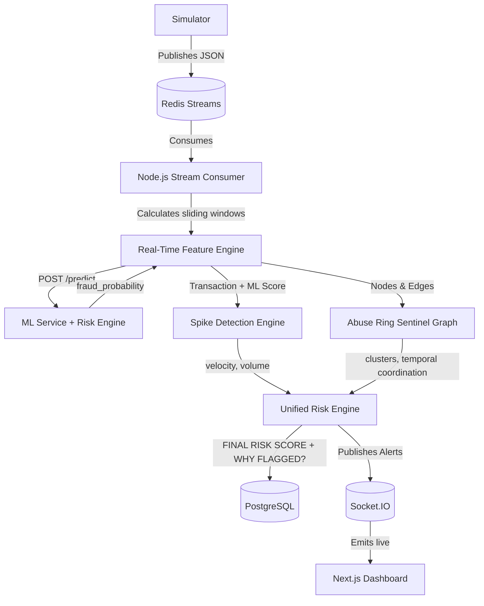

<div align="center">

# 🛡️ Argus

### Real-Time Fraud Spike Detector & Abuse Ring Sentinel

*Catch the spike. Trace the ring. Stop the fraud — in real time.*

🚀 Live Demo

👉 https://argus-blond-pi.vercel.app/rings     Try Argus Live

Explore the live Abuse Ring Detection dashboard and see detected fraud networks in action.

[](https://nodejs.org/)
[](https://www.python.org/)
[](https://nextjs.org/)
[](https://fastapi.tiangolo.com/)
[](https://redis.io/)
[](https://www.postgresql.org/)
[](#-license)

</div>

---

## 📖 Table of Contents

- [Overview](#-overview)
- [Key Features](#-key-features)
- [Architecture](#-architecture)
- [Tech Stack](#-tech-stack)
- [Project Structure](#-project-structure)
- [Detection Pipeline](#-detection-pipeline)
- [Fraud Risk Scoring](#-fraud-risk-scoring)
- [Abuse Ring Detection](#-abuse-ring-detection)
- [Real-Time Dashboard](#-real-time-dashboard)
- [Local Development](#-local-development)
- [Environment Variables](#-environment-variables)
- [ML Service](#-ml-service)
- [API Reference](#-api-reference)
- [Socket.IO Events](#-socketio-events)
- [Simulator](#-simulator)
- [Deployment](#-deployment)
- [Security](#-security)
- [Limitations](#-limitations)
- [Roadmap](#-roadmap)
- [Screenshots](#-screenshots)
- [License](#-license)

---

## 🚀 Overview

**Argus** is a real-time financial fraud detection and abuse-ring investigation system built to protect transaction streams as they happen — not after the fact. It ingests high-throughput transaction data and instantly detects:

| Threat Type | What It Catches |
|---|---|
| 🎯 **Transaction-level fraud** | Suspicious individual transactions via offline-trained ML (LightGBM) |
| 📈 **Velocity spikes** | Sudden, coordinated bursts in transaction volume or cumulative amount |
| 🕸️ **Abuse rings** | Coordinated networks of accounts, devices, and IPs moving in sync |

> **Note:** This repository is a technical/demo implementation running on synthetic transaction traffic. It is not currently integrated with a live payment gateway.

---

## ✨ Key Features

- **Real-time transaction streaming** — ingestion and processing of high-velocity synthetic traffic
- **ML fraud scoring** — feature extraction + inference via a pre-trained LightGBM model
- **Rule-based risk signals** — device/IP sharing, amount similarity, and coordination checks
- **Velocity/spike detection** — sliding-window mechanics to catch volume and velocity anomalies
- **Abuse-ring detection** — in-memory graph engine surfacing coordinated multi-actor attacks
- **Graph-based investigation** — visual relationship mapping of Account ↔ Device ↔ IP ↔ Merchant
- **Redis Streams** — high-throughput async broker decoupling simulator and consumer
- **PostgreSQL persistence** — durable storage for transactions, alerts, and ring states via Prisma ORM
- **Socket.IO live updates** — low-latency WebSocket telemetry to the frontend
- **Analyst dashboard** — a Next.js command center for monitoring threats and system health
- **Transaction investigation** — deep-dive modal into flagged transactions and ML features
- **Ring exploration** — dedicated workspace for traversing extracted abuse rings
- **Spike timeline** — visual timeline of volumetric attacks

---

## 🏗️ Architecture

Argus runs an event-driven streaming architecture bridging a high-throughput Node.js layer with a decoupled Python ML microservice.



> The ML service (FastAPI) is strictly decoupled from the Node backend, exposing a unified prediction endpoint over HTTP.

---

## 🧰 Tech Stack

| Layer | Technology |
| :--- | :--- |
| **Frontend** | Next.js 14, React, Tailwind CSS, Recharts |
| **Backend** | Node.js, Express, TypeScript |
| **Streaming** | Redis Streams (via `ioredis`) |
| **Database** | PostgreSQL, Prisma ORM |
| **Cache/Queue** | Redis Pub/Sub |
| **ML** | Python, FastAPI, LightGBM, Scikit-Learn, Pandas |
| **Visualization** | Custom Graph Visualizer, D3/Recharts concepts |
| **Real-time comms** | Socket.IO |
| **Deployment** | Docker (ML), Node Runtime, Static/Vercel (Frontend) |

---

## 📂 Project Structure

```
fraud-spike-detector/
├── web/                            # Next.js Command Center (Frontend)
├── streaming/                      # Node.js Event Consumer & API Backend
├── ML/                             # Python FastAPI Service & Model Training Pipelines
├── README.MD                       # Project Documentation
├── BACKEND.MD                      # Detailed backend architecture notes
├── PLAN.MD                         # Execution roadmap
├── .gitignore                      # Global git ignores
└── docs/assets/architecture.png    # UI Screenshot
```

---

## 🔄 Detection Pipeline

1. **Transaction generation** — `simulator.ts` generates synthetic baseline traffic plus targeted attacks
2. **Redis stream** — transactions are pushed to a Redis Stream (`transactions:stream`)
3. **Consumer** — the Node.js event loop pulls messages sequentially
4. **ML prediction** — historical features are bundled and sent to FastAPI to retrieve a base fraud probability
5. **Risk scoring** — the stream passes through Spike and Graph engines to accumulate rule-based penalties
6. **Spike detection** — rolling baselines detect volumetric attacks
7. **Ring detection** — an in-memory graph connects entities to detect shared infrastructure and synchronized timing
8. **PostgreSQL** — the final normalized transaction, features, and relationship edges are stored durably
9. **Socket.IO** — a Redis subscriber listens for alerts and broadcasts them over WebSockets
10. **Analyst dashboard** — the Next.js frontend updates visually in real time

---

## 🎯 Fraud Risk Scoring

Every transaction gets a final risk score (`0–100`) aggregated from multiple signals:

- **ML probability** — the raw prediction score from the LightGBM model
- **Velocity** — exponential penalties for rapid-succession transactions
- **Amount anomaly** — flags for suspiciously repetitive transaction values
- **Temporal coordination** — high synchronization between independent accounts
- **Shared device/IP** — connections to known high-risk hardware or network identifiers

Final score maps to severity: `LOW` → `MEDIUM` → `HIGH` → `CRITICAL`

---

## 🕵️ Abuse Ring Detection

The Graph Engine dynamically maps relationships within a sliding time window:

```
Account → uses → Device
Account → connects → IP
```

When multiple supposedly distinct accounts share the same hardware or network parameters within a tight temporal window, the engine extracts a sub-graph cluster, scores the severity of the overlap, and emits an **Abuse Ring** alert.

---

## 📊 Real-Time Dashboard

The Next.js frontend is split into three investigative views:

1. **Command Center** — live system metrics, real-time transaction stream, velocity chart, global alerts
2. **Ring Explorer** — dedicated workspace for visualizing extracted abuse rings, network graph, and scoring signals
3. **Spike Timeline** — historical and active visualization of volumetric anomalies and velocity thresholds

---

## 💻 Local Development

### Requirements

- Node.js (v18+)
- Python (3.11+)
- [`uv`](https://github.com/astral-sh/uv) — fast Python package installer
- PostgreSQL
- Redis

### Startup Sequence

**1. Start infrastructure** (Redis and PostgreSQL)

**2. Set up databases**
```bash
cd streaming
npx prisma db push
npx prisma generate
```

**3. Boot the ML service**
```bash
cd ML
uv sync
uv run uvicorn app.api:app --host 127.0.0.1 --port 8000
```

**4. Boot the streaming backend & consumer**
```bash
cd streaming
npm install
npm run dev              # Starts the REST/WebSocket API

# In a new terminal:
npx ts-node src/consumer.ts

# In a new terminal:
npx ts-node src/simulator.ts
```

**5. Boot the frontend**
```bash
cd web
npm install
npm run dev
```

---

## 🔐 Environment Variables

Copy the provided `.env.example` files to `.env` / `.env.local` in their respective directories.

**Frontend** — `web/.env.local`
| Variable | Description |
|---|---|
| `NEXT_PUBLIC_API_URL` | Points to the Node.js backend (e.g., `http://localhost:4000`) |

**Backend** — `streaming/.env`
| Variable | Description |
|---|---|
| `DATABASE_URL` | PostgreSQL connection string |
| `REDIS_URL` | Redis connection string |
| `ML_API_URL` | Points to the FastAPI ML service (e.g., `http://127.0.0.1:8000`) |
| `FRONTEND_URL` | Used for strict CORS enforcement in production |
| `NODE_ENV` | Set to `production` to enforce environment variable validation |

**ML Service** — `ML/.env`
| Variable | Description |
|---|---|
| `PORT` | Dynamic port binding (defaults to `8000`) |

> ⚠️ The `.env.example` templates contain safe, fake data. Never commit real credentials.

---

## 🤖 ML Service

The ML service is an isolated Python microservice built with FastAPI. It loads a pre-trained LightGBM model and exposes a low-latency `/predict` endpoint.

**Run locally:**
```bash
cd ML
uv sync
uv run uvicorn app.api:app --host 127.0.0.1 --port 8000
```

**Run via Docker:**
```bash
cd ML
docker build -t fraud-ml-service .
docker run -p 8000:8000 -e PORT=8000 fraud-ml-service
```
A production `Dockerfile` is provided that uses `uv` for minimal, fast dependency resolution.

---

## 🔌 API Reference

The Node.js backend (`streaming/src/server.ts`) exposes the following REST endpoints:

| Method | Endpoint | Description |
|---|---|---|
| `GET` | `/api/health` | Health check |
| `GET` | `/api/dashboard/metrics` | Aggregated live metrics |
| `GET` | `/api/rings` | List of detected abuse rings |
| `GET` | `/api/rings/:id` | Detailed view of a specific ring |
| `GET` | `/api/spikes` | List of velocity spikes |
| `GET` | `/api/transactions/:id` | Transaction detail |
| `POST` | `/api/investigations` | Create an analyst investigation |

---

## 📡 Socket.IO Events

| Event | Description |
|---|---|
| `ring_detected` | Full graph and scoring data when a new abuse ring is confirmed |
| `spike_detected` | Alerts when transaction velocity breaches critical thresholds |
| `new_transaction` | Streams normalized transactions as they're processed |
| `metrics_update` | Updated system-wide aggregations (money at risk, TPS, latency) |

---

## 🎲 Simulator

`streaming/src/simulator.ts` generates synthetic transactions for demonstration and load-testing. It injects organic traffic alongside coordinated **spike attacks** and **credential-stuffing rings**.

> ⚠️ It is **not** intended to be a production data source — replace it with a live payment gateway webhook or Kafka ingestion layer in a real deployment.

---

## ☁️ Deployment

The intended production architecture is decoupled and scalable:

- **Frontend** — Next.js deployed statically to Vercel or a CDN
- **Backend & Consumer** — Node.js services deployed as auto-scaling containers (ECS, Cloud Run)
- **ML Service** — Python FastAPI deployed as a containerized service
- **Database** — managed PostgreSQL instance (AWS RDS, Supabase)
- **Cache/Queue** — managed Redis instance (Upstash, ElastiCache)

---

## 🔒 Security

- Secrets and connection strings are strictly managed via environment variables
- `.env` files and Redis dumps (`dump.rdb`) are explicitly `.gitignore`d
- Production CORS origins are dynamically configurable via `FRONTEND_URL`
- Internal microservice routing (`ML_API_URL`) is environment-based, keeping internal traffic off public interfaces

---

## ⚠️ Limitations

- **Synthetic data** — all transaction data is artificially generated
- **Authentication** — the frontend login is currently a hardcoded/demo placeholder
- **Payment integration** — no integration with actual payment processors (Stripe, Adyen, etc.)
- **Model training** — LightGBM was trained on synthetic datasets tailored to demonstrate dashboard features
- **Deployment readiness** — containerized and validates env vars, but built as a technical demonstration rather than PCI-compliant banking infrastructure

---

## 🗺️ Roadmap

- [ ] Real payment gateway integration (webhooks)
- [ ] Stronger authentication & RBAC for analysts
- [ ] Model monitoring & drift detection
- [ ] Dedicated feature store for the ML pipeline
- [ ] Distributed worker queues for the consumer
- [ ] Better alert routing (Slack/PagerDuty)
- [ ] Analyst case management persistence
- [ ] Production-grade observability (Datadog/Prometheus)

---

## 🖼️ Screenshots

A screenshot of the dashboard interface is available at `docs/assets/architecture.png`.

ML training metrics and PR curves are available in `ML/reports/` and `ML/frontend/public/`.

---

## 📄 License

This project is licensed under the **MIT License** — see the \LICENSE` file for details.`

---

<div align="center">

Built for the **Razorpay Buildathon** 🏗️

</div>
